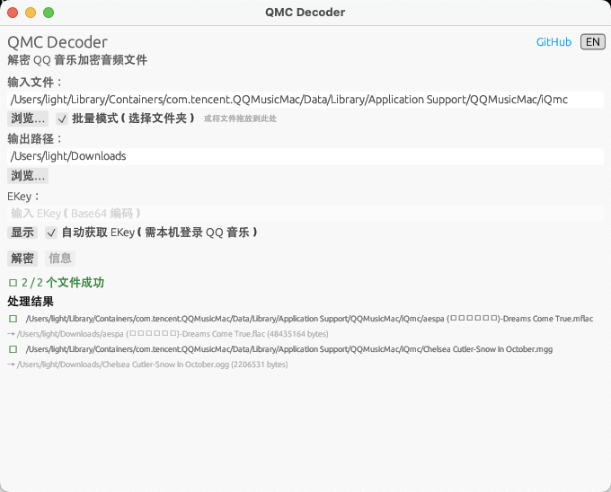

<div align="center">

# 🎵 QMC Decoder

**解密 QQ 音乐加密音频文件（QMC1/QMC2 格式）**

支持自动获取 ekey · 内置图形界面 · 批量解密 · 仅 macOS

[](LICENSE) [](https://www.rust-lang.org/)

</div>

---

## 🖼️ 界面预览



## ✨ 特性

| | |
|:---|:---|
| 🖥️ **图形界面** | 内置 GUI，支持中英文切换、拖放文件、原生文件选择器 |
| ⌨️ **CLI 模式** | 完整的命令行界面，适合脚本和自动化场景 |
| 🔑 **自动获取 ekey** | 从本机 QQ 音乐客户端读取凭据，自动调用 API 获取解密密钥 |
| 📂 **批量解密** | 传入目录即可批量处理所有支持的加密文件 |
| 🔍 **文件信息** | `--info` 命令可检测文件格式、尾部类型、元数据，无需解密 |
| 🍎 **macOS .app** | 双击 `.app` 即可启动图形界面，不弹出终端 |

## 支持的格式

| 格式 | 扩展名 | 输出 | 需要密钥 |
|------|--------|------|----------|
| QMC1 | `.qmc0`, `.qmc3` | `.mp3` | 否（固定密码） |
| QMC1 | `.qmc2`, `.qmcogg` | `.ogg` | 否（固定密码） |
| QMC1 | `.qmcflac` | `.flac` | 否（固定密码） |
| QMC2 | `.mgg`, `.mgg0`, `.mgg1`, `.mggl` | `.ogg` | 是（ekey） |
| QMC2 | `.mflac`, `.mflac0`, `.mflach` | `.flac` | 是（ekey） |

## 🔐 关于 QMC 加密

QQ 音乐使用两种加密方案：

### QMC1（旧版）
使用基于固定种子的 XOR 密码。无需外部密钥——解密算法基于字节偏移量是完全确定性的。适用于旧版 `.qmc0`、`.qmc3`、`.qmcflac`、`.qmcogg` 文件。

### QMC2（新版）
使用 ekey（加密密钥），配合 Map XOR 密码（密钥 ≤ 300 字节）或修改版 RC4 流密码（密钥 > 300 字节）。ekey 经过 base64 编码，并使用腾讯的 TC-TEA 算法进一步加密。

ekey 有三种存储方式：

1. **QTag 格式**（旧版 QMC2）：ekey 与歌曲 ID 一起嵌入在文件末尾，后跟 "QTag" 魔术标记。解码器会自动提取。

2. **V1 格式**：文件末尾 4 字节存储原始密钥大小，密钥字节位于大小字段之前。解码器会自动提取。

3. **musicex 格式**（最新版，QQ 音乐 ≥ 19.57）：ekey **未嵌入**文件中。文件尾部仅包含元数据（歌曲 ID、歌曲 mid、文件名）。必须通过 `--ekey` 参数提供 ekey 或使用 `--fetch-ekey` 自动从 QQ 音乐 API 获取。

## 📦 安装

### 从源码编译

**CLI + GUI（推荐）：**

```bash
git clone https://github.com/ownlight6/qmc-decoder.git
cd qmc-decoder
cargo build --release --features gui
```

**仅 CLI（无图形界面）：**

```bash
cargo build --release
```

编译产物位于 `target/release/qmc-decoder`。

### macOS .app 包

macOS 上直接运行可执行文件不带参数会启动图形界面。使用 `.app` 包可以双击直接启动，无需终端：

```bash
./scripts/create-app-bundle.sh target/release/qmc-decoder
```

生成 `QMC Decoder.app`，双击即可打开图形界面。

> CI 构建会自动生成 `.app` 包（`qmc-decoder-macos-*-app.tar.gz`），下载后解压即可使用。

### 前置要求

- Rust 1.70+（推荐使用 [rustup](https://rustup.rs/) 安装）
- macOS（`--fetch-ekey` 功能依赖 macOS 版 QQ 音乐客户端）

## 🚀 使用

### 图形界面（需 `--features gui` 编译）

```bash
# 直接运行（无参数）自动启动图形界面
qmc-decoder

# 或显式指定 --gui
qmc-decoder --gui
```

- **文件选择** — 点击浏览按钮选择文件，或直接拖放文件到窗口
- **批量模式** — 勾选"批量模式"可选择文件夹，一次解密所有支持的加密文件
- **EKey 输入** — 手动输入 EKey（密码模式，可显示/隐藏），或勾选"自动获取 EKey"
- **自动获取 EKey** — 勾选后自动从本机 QQ 音乐凭据获取密钥（需已登录 QQ 音乐）
- **中英文切换** — 右上角语言按钮，一键切换中文 / English
- **文件选择器默认目录** — 自动打开 QQ 音乐下载文件夹

> 如果未编译 GUI 功能，运行 `qmc-decoder` 不带参数会提示使用 `--features gui` 重新编译。

### 命令行使用

```bash
# 查看文件信息（检测格式、尾部类型、元数据）
qmc-decoder --info /path/to/file.mgg

# 解密 QMC1 文件（无需密钥）
qmc-decoder /path/to/file.qmcflac /path/to/output.flac

# 解密带有 QTag 尾部的 QMC2 文件（自动提取 ekey）
qmc-decoder /path/to/file.mgg1 /path/to/output.ogg

# 解密 musicex 文件，自动获取 ekey
qmc-decoder --fetch-ekey /path/to/file.mgg

# 解密 musicex 文件，手动提供 ekey
qmc-decoder --ekey "BASE64_EKEY" /path/to/file.mgg /path/to/output.ogg

# 查看文件信息并检查凭据状态（判断 --fetch-ekey 是否可用）
qmc-decoder --info --fetch-ekey /path/to/file.mgg

# 批量解密目录中所有支持的文件
qmc-decoder /path/to/input_dir/ /path/to/output_dir/

# 如果未指定输出路径，输出文件将使用相同文件名并更改扩展名
qmc-decoder /path/to/file.qmc0
# 生成：/path/to/file.mp3
```

<details>
<summary>📋 完整参数</summary>

```
qmc-decoder [OPTIONS] [INPUT] [OUTPUT]

Arguments:
  [INPUT]   输入文件或目录
  [OUTPUT]  输出文件或目录（可选，默认同目录更改变扩展名）

Options:
      --ekey <EKEY>        EKey for QMC2 decryption (base64 encoded)
      --fetch-ekey         自动从 QQ 音乐 API 获取 ekey（需本机登录 QQ 音乐）
      --info               仅显示文件元数据，不解密
      --gui                启动图形界面
  -h, --help               显示帮助
  -V, --version            显示版本
```

</details>

## 🔑 获取 ekey

对于使用 **musicex** 尾部的文件（最新版 QQ 音乐），ekey 并未存储在文件中。可选方案：

### 方案 1：自动从 QQ 音乐 API 获取（推荐）

使用 `--fetch-ekey` 参数自动从 QQ 音乐服务器获取 ekey。**需要本机已登录 QQ 音乐**：

```bash
qmc-decoder --fetch-ekey /path/to/file.mgg
```

解码器会自动：
1. 解析 musicex 尾部，提取歌曲的 media_mid 和文件名
2. 读取本机 QQ 音乐的认证凭据
3. 调用 `music.vkey.GetEVkey` API 获取 ekey
4. 使用获取的 ekey 解密文件

### 方案 2：使用旧版 QQ 音乐客户端

使用 QQ 音乐 ≤ 19.51 版本重新下载文件。旧版本会在文件尾部嵌入 ekey（QTag 格式），解码器可以自动提取。

### 方案 3：手动提供 ekey

使用 `--ekey` 参数提供 base64 编码的 ekey：

```bash
qmc-decoder --ekey "BASE64_EKEY" /path/to/file.mgg
```

> **注意：** 同时提供 `--ekey` 和 `--fetch-ekey` 时，优先使用显式指定的 `--ekey`。

## 🔧 技术细节

### QMC1 算法
- 通过 8×7 种子映射表使用 Z 字形遍历模式生成 64 字节密钥表
- 每个字节与密钥表中索引 `(offset % 0x7FFF) & 0x7F` 处的值进行异或，索引 > 0x3F 时进行反射
- 偏移量 0x8000、0x10000 等处的字节被跳过

### QMC2 密钥推导
1. 对 ekey 进行 base64 解码
2. 如果以 "QQMusic EncV2,Key:" 开头，则为 EncV2 ekey：
   - 使用阶段 1 密钥 `386ZJY!@#*$%^&)(` 通过 TC-TEA 解密前缀后的数据
   - 使用阶段 2 密钥 `**#!(#$%&^a1cZ,T` 通过 TC-TEA 解密上一步结果
   - 对结果进行 base64 解码得到 EncV1 ekey
3. 尝试 EncV1 格式解析：拆分前 8 字节为头部，推导 TEA 密钥，TC-TEA 解密主体
4. 如果 TC-TEA 解密失败（API 获取的原始密钥），则直接使用完整解码数据作为密钥
5. 最终密钥为 头部 + 解密后主体（EncV1）或原始解码字节（API 密钥）

### QMC2 Map 密码（密钥长度 ≤ 300）
- 偏移量 `i` 处的每个字节与 `scramble(key[(i² + 71214) % key_len], (i² + 71214) % key_len)` 进行异或
- `scramble(value, index)` = `value.rotate_left((index + 4) & 7) | value.rotate_right((index + 4) & 7)`

### QMC2 RC4 密码（密钥长度 > 300）
- 前 128 字节（第一段）使用直接密钥查找和段密钥计算
- 剩余字节使用修改版 RC4 流密码，以 5120 字节为一块进行分段
- 每段根据段 ID 计算丢弃计数来重新初始化 RC4 状态

### musicex 尾部格式

使用 musicex 尾部的文件在文件末尾存储元数据：
- 偏移 0x00：歌曲 ID（4 字节，小端序）
- 偏移 0x04：音质类型字段（8 字节）
- 偏移 0x0C：Media MID（60 字节，UTF-16LE）
- 偏移 0x48：文件名（68 字节，UTF-16LE，包含扩展名如 `.mgg`）
- 偏移（尾部大小 - 16）：尾部大小（4 字节 LE）
- 偏移（尾部大小 - 12）：版本号（4 字节 LE，= 1）
- 偏移（尾部大小 - 8）：魔术标记 `"musicex\0"`

完整的解密流程文档请参阅 [MGG 解密流程](MGG_DECRYPTION_FLOW.md)。

## 🧪 测试

```bash
cargo test
```

包含 17 个单元测试，覆盖：

- QMC1 密钥表生成、边界行为、周期性
- QMC2 密钥推导（EncV1、EncV2、TC-TEA 加解密往返）
- QMC2 Map 密码和 RC4 密码
- musicex 尾部解析（正常数据、无效数据）
- UTF-16LE 字符串解码
- ekey 解析往返测试

## 📁 项目结构

```
src/
├── main.rs       — CLI/GUI 双模式入口
├── lib.rs        — 库导出（解密逻辑、格式检测、文件处理）
├── gui.rs        — egui 图形界面（需 --features gui）
├── qmc1.rs       — QMC1 XOR 密码实现
├── qmc2.rs       — QMC2 Map/RC4 密码实现 + ekey 解析
└── ekey_fetch.rs — QQ 音乐 API ekey 自动获取
imgs/
└── gui.png          — GUI 界面截图
macos/
└── Info.plist       — macOS .app 包配置
scripts/
└── create-app-bundle.sh — macOS .app 打包脚本
```

## 📄 许可证

本项目基于 [GNU General Public License v3.0](LICENSE) 许可证开源。