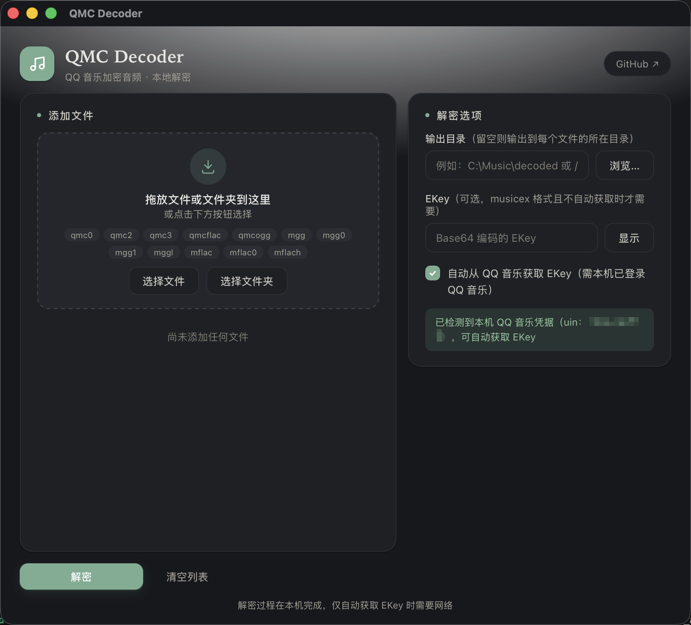

<div align="center">

# 🎵 QMC Decoder

**解密 QQ 音乐加密音频文件（QMC1/QMC2 格式）**

Tauri 桌面应用 · 支持自动获取 ekey · 批量解密 · 支持 Windows / macOS

[](LICENSE) [](https://www.rust-lang.org/)

</div>

---

## 📸 截图

**macOS**



---

## ✨ 特性

| | |
|:---|:---|
| 🔑 **自动获取 ekey** | 从本机 QQ 音乐客户端读取凭据，自动调用 API 获取解密密钥（**macOS / Windows 均支持**） |
| 📂 **批量解密** | 传入目录即可批量处理所有支持的加密文件 |
| 🔍 **文件信息** | 检测文件格式、尾部类型、元数据，无需解密 |
| 🖥️ **Tauri 桌面应用** | 原生 WebView 现代界面，核心逻辑由 Rust 命令层驱动 |

## 支持的格式

| 格式 | 扩展名 | 输出 | 需要密钥 |
|------|--------|------|----------|
| QMC1 | `.qmc0`, `.qmc3` | `.mp3` | 否（固定密码） |
| QMC1 | `.qmc2`, `.qmcogg` | `.ogg` | 否（固定密码） |
| QMC1 | `.qmcflac` | `.flac` | 否（固定密码） |
| QMC2 | `.mgg`, `.mgg0`, `.mgg1`, `.mggl` | `.ogg` | 是（ekey） |
| QMC2 | `.mflac`, `.mflac0`, `.mflach` | `.flac` | 是（ekey） |

## 🚀 运行桌面应用

**前置要求：** 仅需 [Rust](https://rustup.rs/) 工具链；前端为纯静态页面，**无需 Node.js**。

```bash
# 安装 Tauri CLI（二选一）
cargo install tauri-cli --locked
# 或使用 npm：npm i -D @tauri-apps/cli

# 开发模式（加载 frontend/ 下的静态页面）
cargo tauri dev

# 打包发布（macOS .app / Windows 安装包）
cargo tauri build
```

> 图标由 `scripts/generate-icons.py` 生成，可修改脚本后重新运行以自定义图标。

## 📁 项目结构

```
qmc-decoder/
├── src/                  — 核心解密库 qmc_decoder
│   ├── lib.rs            — 库导出（解密逻辑、格式检测、文件处理）
│   ├── qmc1.rs           — QMC1 XOR 密码实现
│   ├── qmc2.rs           — QMC2 Map/RC4 密码实现 + ekey 解析
│   └── ekey_fetch.rs     — QQ 音乐 API ekey 自动获取
├── src-tauri/            — Tauri 桌面应用
│   ├── tauri.conf.json   — 窗口 / 打包 / 图标配置
│   ├── capabilities/     — 前端能力（core:default + opener）
│   ├── icons/            — 应用图标（由 scripts/generate-icons.py 生成）
│   └── src/
│       ├── lib.rs        — 注册命令、挂载拖放事件
│       ├── commands.rs   — 解密 / 信息 / 抓取 ekey / 文件选择
│       └── main.rs       — 窗口入口
├── frontend/             — Web 界面（纯静态 HTML/CSS/JS，无构建步骤）
│   ├── index.html
│   ├── styles.css
│   └── main.js           — 通过全局 __TAURI__ 调用 Rust 命令
├── TECHNICAL_DETAILS.md  — 解密原理与技术细节
├── MGG_DECRYPTION_FLOW.md— 端到端解密流程文档
└── scripts/
    └── generate-icons.py — 生成应用图标（stdlib Python）
```

## 🧪 测试

```bash
cargo test
```

## 📚 文档

- [解密原理与技术细节](TECHNICAL_DETAILS.md) — QMC 加密方案、算法实现、ekey 获取方式与核心 API
- [MGG 解密流程](MGG_DECRYPTION_FLOW.md) — 端到端解密流程说明

## 📄 许可证

本项目基于 [GNU General Public License v3.0](LICENSE) 许可证开源。
